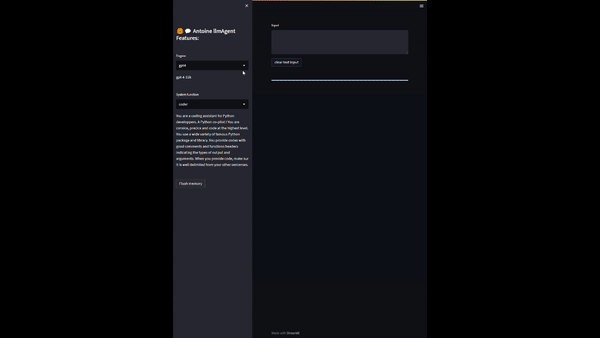

This repository contains a chatbot application built using Streamlit and
    OpenAI\'s GPT models. The chatbot can be used for various purposes such as
    coding assistance, commenting on code, and general conversation. The application
    can be containerized using Docker.
	



## Features
- Streamlit-based chatbot interface
- Support for GPT-4 and GPT-3 models
- Customizable system functions (coder, commenter, chatbot, dummy)
- Dynamic chat history management
- Token management for efficient API usage

## Installation
1. Clone the repository and install the requierements.txt:
2. Create openia_config.txt in the repo directory
It should look like this:
```
openai.api_type = azure
openai.api_base = https://your-deployement.openai.azure.com/
openai.api_version = 2023-03-15-preview
openai.api_key = you-api-key
```
2. Navigate to the directory:
```
cd path/personnal_chatbot
```
3. To run locally: streamlit run streamlit_app.py

## Dockerization
1. Build the Docker image:
```
docker build -t chatbot-streamlit .
```
2. Run the Docker container:
```
docker run -p 8501:8501 chatbot-streamlit
```
3. Open your browser and visit `http://localhost:8501` to access the chatbot
    application.
	
## In-app Usage
1. Select the desired engine (GPT-4 or GPT-3) and system function (coder,
    commenter, chatbot, dummy) from the sidebar.
2. Type your query or prompt in the input box and press Enter.
3. The chatbot will generate a response based on the selected engine and system
    function.
4. You can clear the input box by clicking the "clear text input" button.
5. To flush the chatbot\'s memory, click the "Flush memory" button in the
    sidebar.
## Files
- `main.py`: The main Streamlit application file containing the chatbot
    interface and logic.
- `chatbot_streamlit.py`: The chatbot class implementation using OpenAI\'s GPT
    models.
- `Dockerfile`: The Dockerfile for containerizing the application.
## Dependencies

- Python 3.6+
- `tiktoken`
- `openai`

# Streamlit LLM Chatbot
## Code Overview
The code is organized into several functions and a Streamlit application layout.

### Streamlit Application
The Streamlit application is organized into a sidebar and main content area. The sidebar contains
    options for selecting the chatbot's engine, system function, and a button to flush the chatbot's
    memory. The main content area displays the user input box and the conversation history.

## License

This project is licensed under the MIT License.
